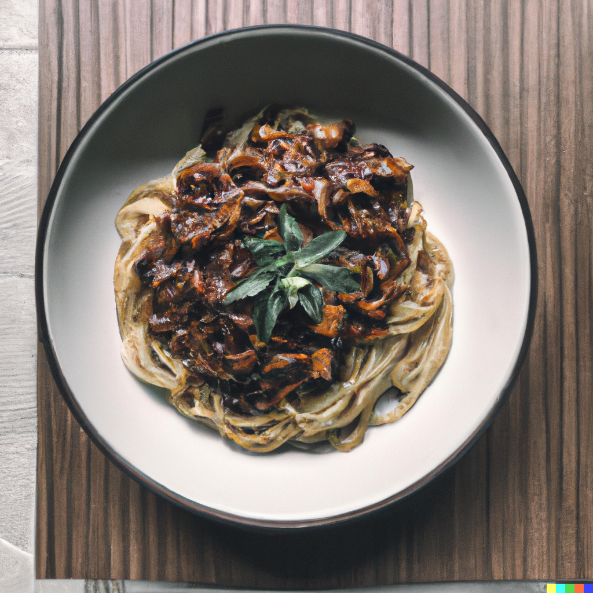

Eggplant Jajangmyeon Noodles
============================

| 2 servings
| 10 min preparation time
| 15 min cooking time

Ingredients
-----------

* 1 red onion
* 1 eggplant (preferably japanese pickling variety)
* 2 Jajangmyeon instant noodle
* fresh herbs
* crushed peanuts

For the sauce:

* 1 tbsp dark soy sauce
* 1 tbsp light soy sauce
* 1 tbsp oyster sauce
* 1,5 tbsp Worcestershire sauce

Instructions
------------

#. Mince the red onion and cut the aubergine into small dices.
#. Brown them on medium heat for 8-10 minutes in a wok.
#. Boil the 2 noodles as per the instructions on the packaging.
#. Save a cup of cooking water from the noodles when noodles are almost done.
#. Strain the noodles and rinse them with cold water.
#. Mix all the sauce ingredients.
#. add the noodles, the sauce and one jajang dehydrated powder to the wok, stir fry for 1 minute
   on high heat.
#. Serve in large bowls and top with minced fresh herbs and crushed peanuts.
