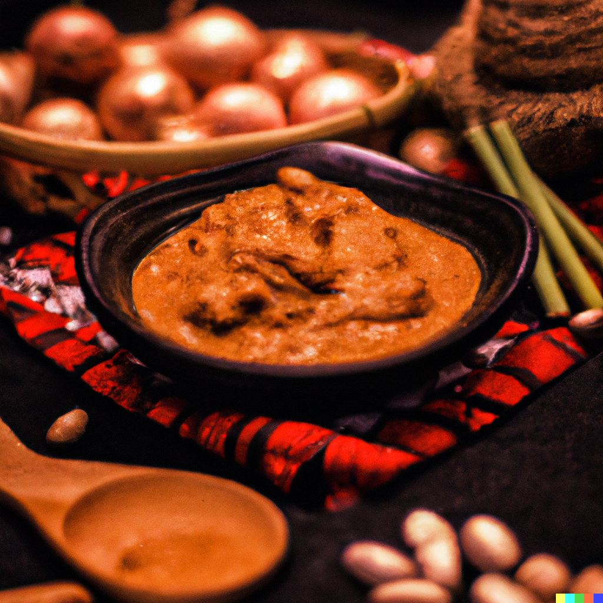

Peanut and Fermented Soy Sauce
==============================

For 4 servings

Preparation time:

Cooking time:

Ingredients
-----------

* 4 tbsp peanut butter watered down
* 2 tbsp Hoi Sin sauce
* 2.5 fermented soy paste cubes
* 1 tsp sesame oil
* 50g roasted peanuts

Instructions
------------

#. Crush the peanuts into crumbles
#. Mix all the ingredients
#. Add 1 more tbsp of Hoi Sin sauce if needed.
